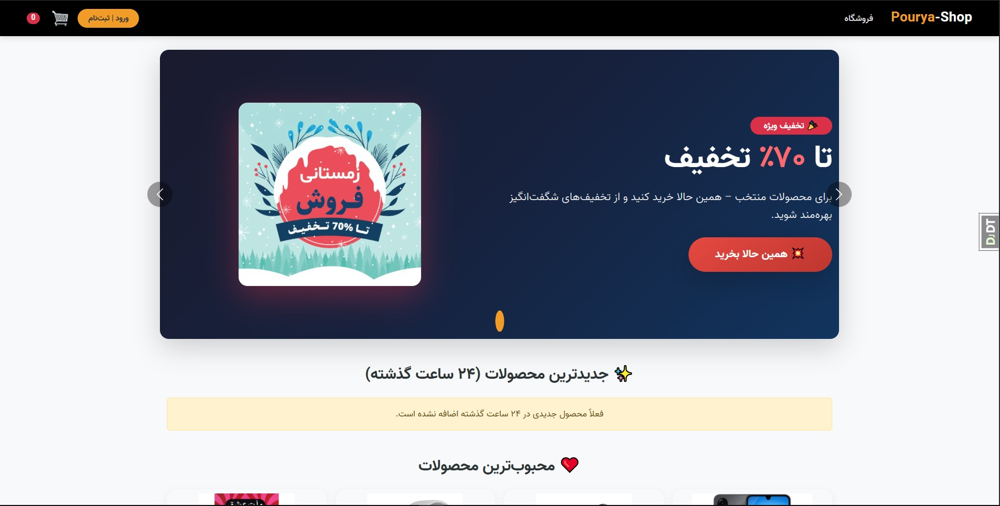
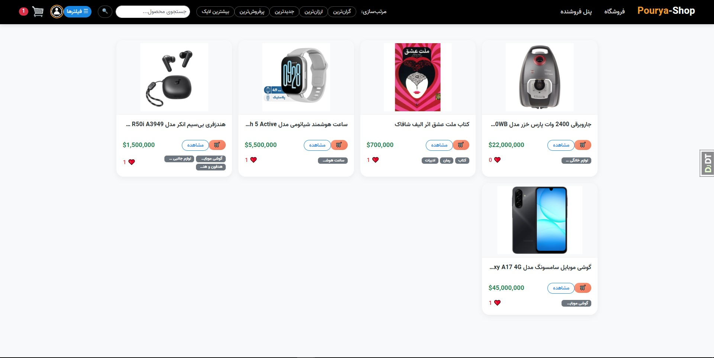
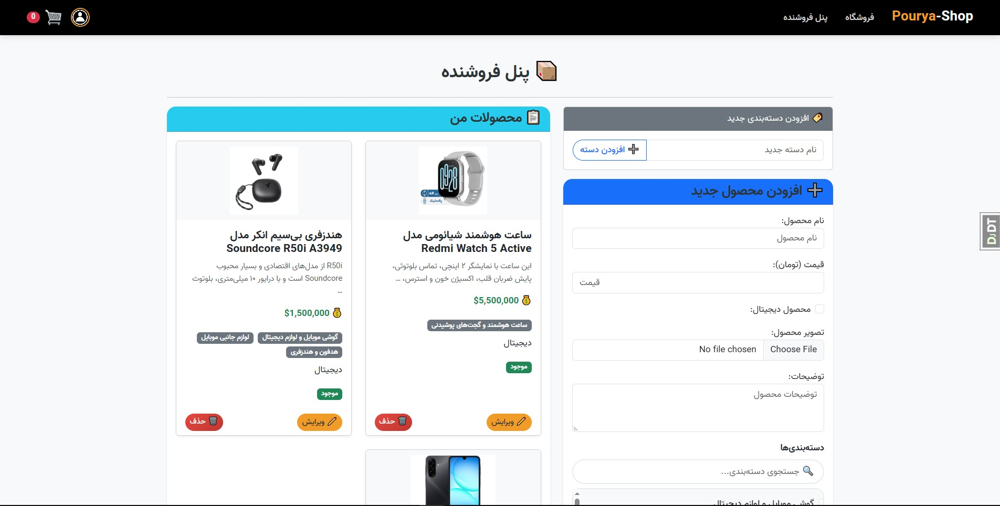

# 🛒 Pourya Online Shop

[](https://www.python.org/)
[](https://www.djangoproject.com/)
[](https://www.django-rest-framework.org/)

یک فروشگاه آنلاین کامل با جنگو، شامل پنل فروشنده، سبد خرید، احراز هویت پیشرفته، API مستند و بهینه‌سازی‌شده برای عملکرد بالا.

---

## ✨ ویژگی‌ها

-   **احراز هویت کامل**: ورود، ثبت‌نام، تغییر رمز، فراموشی رمز عبور با ارسال ایمیل
-   **پنل فروشنده**: مدیریت محصولات، دسته‌بندی‌ها، وضعیت موجودی
-   **سبد خرید**: افزودن/حذف محصولات، تسویه‌حساب
-   **سیستم لایک و نظرات**: کاربران می‌توانند محصولات را لایک کرده و نظر بدهند
-   **فیلتر و جستجو**: مرتب‌سازی بر اساس قیمت، جدیدترین، پرفروش‌ترین، بیشترین لایک
-   **API کامل**: با مستندات Swagger و Redoc
-   **بهینه‌سازی کوئری**: استفاده از `select_related`، `prefetch_related` و `only()`
-   **تست‌های جامع**: ۴۰ تست با پوشش بالا (pytest)
-   **طراحی واکنش‌گرا**: با Bootstrap 5 و پشتیبانی از RTL (فارسی)
-   **تحلیل عملکرد**: ابزارهای Silk و Debug Toolbar برای مانیتورینگ کوئری‌ها

---

## 🛠️ تکنولوژی‌ها

| بخش | تکنولوژی |
|-----|----------|
| Backend | Django 5.2, Django REST Framework |
| Database | SQLite (قابل تغییر به PostgreSQL) |
| Authentication | JWT (SimpleJWT) + Session |
| API Documentation | Swagger/OpenAPI (drf-spectacular) |
| Frontend | Bootstrap 5, jQuery |
| Testing | pytest, pytest-django, pytest-cov |
| Performance | Silk, Django Debug Toolbar |
| Linting | Black, isort, flake8, pre-commit |

---

## 📸 دمو

*(برای اضافه کردن تصاویر، یک پوشه `screenshots/` در ریشه پروژه بسازید و تصاویر را قرار دهید.)*

| صفحه | تصویر |
|------|-------|
| صفحه اصلی |  |
| فروشگاه |  |
| پنل فروشنده |  |
| API Swagger |  |

---

## 🚀 نصب و راه‌اندازی

### پیش‌نیازها

-   Python 3.10 یا بالاتر
-   pip
-   (اختیاری) virtualenv

### مراحل نصب

```bash
# ۱. کلون کردن پروژه
git clone https://github.com/Pourya84/Pourya-Online-Shop.git
cd Pourya-Online-Shop

# ۲. ایجاد و فعال‌سازی محیط مجازی
python -m venv venv
venv/Scripts/activate

# ۳. نصب وابستگی‌ها
pip install -r requirements.txt

# ۴. اعمال مایگریشن‌ها
python manage.py migrate

# ۵. ایجاد کاربر ادمین (اختیاری)
python manage.py createsuperuser

# ۶. اجرای سرور توسعه
python manage.py runserver